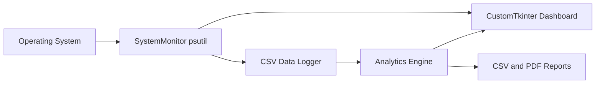

# OSInsight-AI

OSInsight-AI is a desktop system-performance analyzer for Windows, Linux, and macOS. It samples local CPU, memory, disk, and process activity, keeps a portable CSV history, forecasts near-term CPU and memory pressure, identifies resource bottlenecks, and exports health reports.

## Features

- Live CPU, memory, disk, process-count, and top-process monitoring
- Historical CSV logging with a sample-ready data model
- Explainable linear-regression forecasts for CPU and memory usage
- Health score, warning levels, bottleneck detection, and recommendations
- CustomTkinter dashboard with CSV and PDF exports
- Unit tests for preprocessing and analytics behavior

## Architecture



## Installation

```bash
git clone https://github.com/sanchit11092007/OSInsight-AI.git
cd OSInsight-AI
python -m venv .venv
.venv\Scripts\activate  # Windows
pip install -r requirements.txt
python main.py
```

On macOS/Linux, activate the environment with `source .venv/bin/activate`.

## Usage

Launch `python main.py`. The dashboard refreshes every three seconds. Use **Export CSV** to save the session history or **Export PDF** to create a concise system-health report. The application only reads local telemetry; it does not transmit system data.

## Project layout

```text
analytics/       Forecasting, data cleaning, health scoring
monitoring/      psutil collection and historical logging
gui/             CustomTkinter dashboard
utils/           Export helpers
diagrams/        Mermaid architecture and workflow diagrams
documentation/   Technical notes and test cases
report/          Submission report in DOCX and PDF
ppt/             15-slide project presentation
tests/           Automated unit tests
```

## Testing

```bash
python -m pytest -q
```

## Screenshots

Run the dashboard locally and save captures in `screenshots/`. The report and presentation describe the expected live view without embedding machine-specific process information.

## Technology stack

Python 3.12+, CustomTkinter, psutil, pandas, NumPy, scikit-learn, matplotlib, joblib, ReportLab, and pytest.

## Future scope

- Per-process time-series retention and anomaly detection
- Configurable alert thresholds and notifications
- Pluggable forecasting models trained on longer histories
- Secure remote fleet aggregation with opt-in telemetry

## Contributors

Sanchit11092007 and project contributors.

## License

Distributed under the [MIT License](LICENSE).
